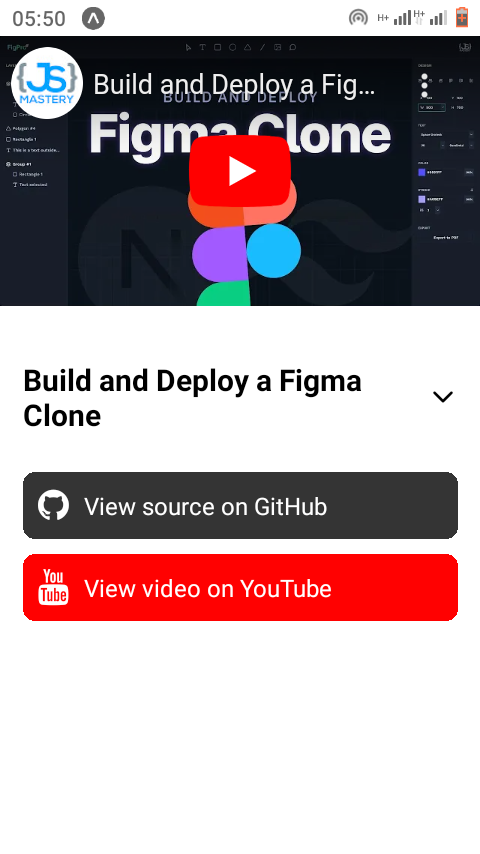
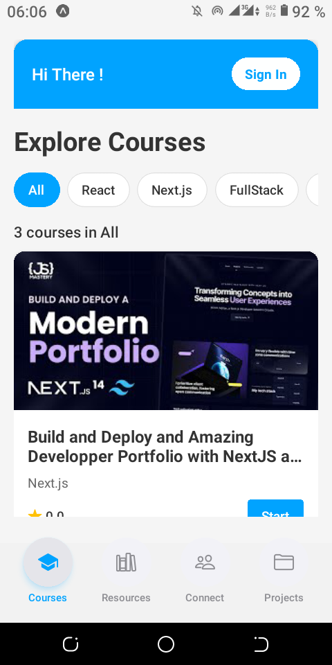
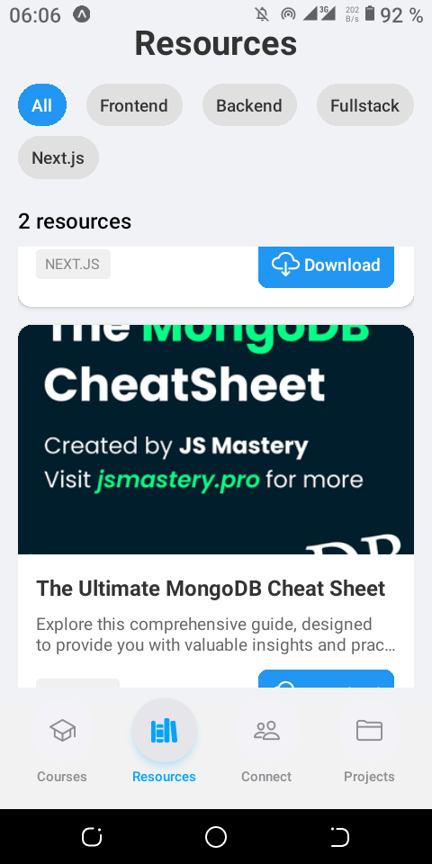
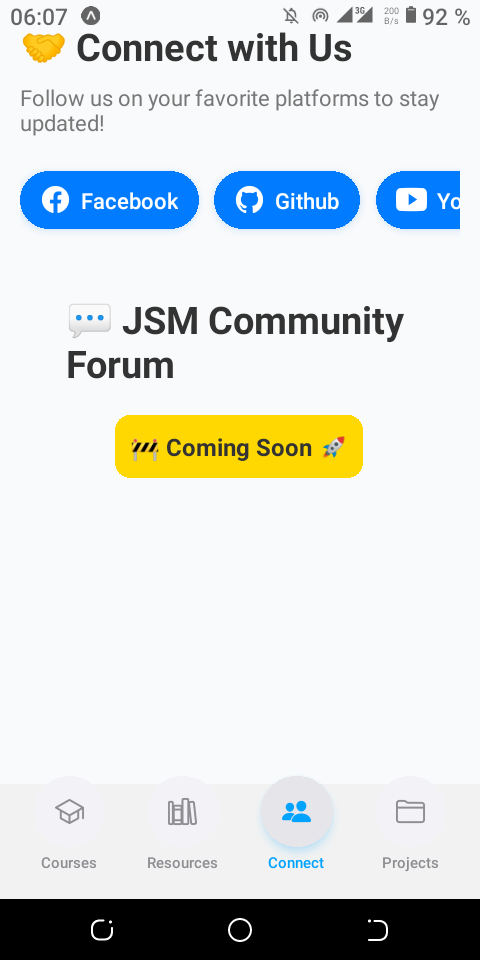
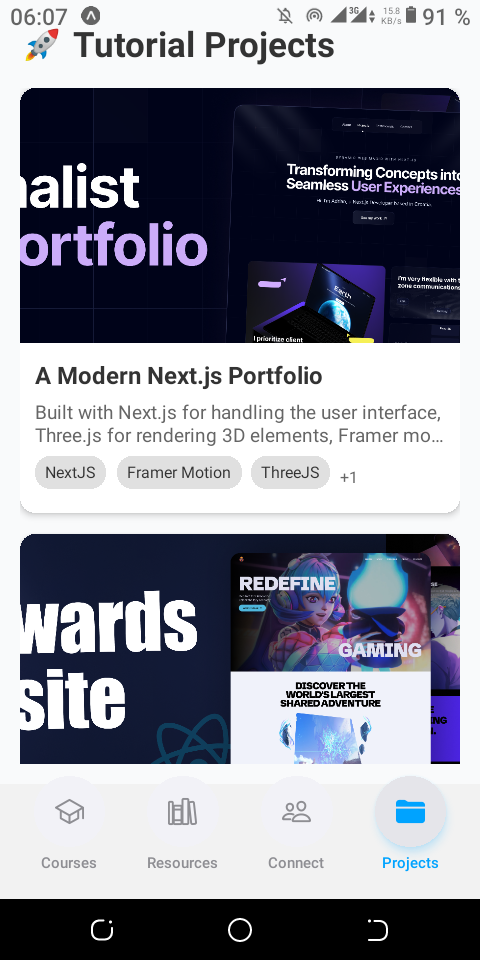

<div align="center">
  <br />
    <a href="https://youtu.be/ZBCUegTZF7M?si=ubt0vk70lSjt6DCs" target="_blank">
      
    </a>
  <br />

  <div>
    
    
    
  </div>

  <h3 align="center">JSM Mobile App</h3>

   <div align="center">
     This App is the implementation of the  <a href="https://www.youtube.com/@javascriptmastery/videos" target="_blank"><b>JavaScript Mastery</b></a> YouTube Website channel. <br /> Join the JSM family!
    </div>
</div>

## 📋 <a name="table">Table of Contents</a>

1. 🤖 [Introduction](#introduction)
2. ⚙️ [Tech Stack](#tech-stack)
3. 🔋 [Features](#features)
4. 🤸 [Quick Start](#quick-start)
5. 🕸️ [Screenshots](#snippets)
6. 🔗 [Links](#links)
7. 🚀 [More](#more)

## 🚨 Tutorial

This repository contains the code corresponding to the mobile app created in the occasion of 1M suscribers Hackathon organized by  <a href="https://www.youtube.com/@javascriptmastery/videos" target="_blank"><b>JavaScript Mastery</b></a>. 

This is not an official version of the app crafted by the channel or the website. All credits, creations and brand belong to <a href="https://www.github.com/adrianhajdin"><b>Adrian Hajdin</b></a> by the way of <a href="https://www.youtube.com/@javascriptmastery/videos" target="_blank"><b>JavaScript Mastery</b>

<a href="https://expo.dev/artifacts/eas/mPL9JLmXALPbYd1QvVaWPz.apk" target="_blank">    </a>

## <a name="introduction">🤖 Introduction</a>

Built with React Native Expo for seamless user experiences, React Native Reanimated for captivating animations, seamless and easy to use authentication with Clerk and integrated with the dependable backend systems of <b>Appwrite</b>, 
this app showcases all the power, features and professionalism of the JavaScript Mastery family.


## <a name="tech-stack">⚙️ Tech Stack</a>

- React Native
- Expo
- React Native Reanimated
- Appwrite
- Clerk
- Devvie Bottom Sheet

## <a name="features">🔋 Features</a>

👉 **Engaging and branded Splashscreen**: Engaging graphics welcome users to the app.

👉 **Robust Authentication & Authorization System**: Secure email login safeguards user accounts using Clerk.

👉 **Dynamic Home Screen with multiples sections**: Dynamic Home Screen showing the traditionnal ***Hi There !*** of Adrian and list all the latest courses of the JavaScript Mastery Youtube channel with filters with ratings and thumbnail.

👉 **View course details and directly plays  Functionality**: Users can access course details by clicking on it, play it and view the associated project on GitHub and the YouTube link also

👉 **Full access to ressources**: Efficiently access with filters by categories all the ressources shared on the JSM website for FREE and download them

👉 **Tab Navigation**: Navigate between sections like Home, Ressources, and Projects with ease using tab navigation.

👉 **Projects with Github link**: Smoothly access in one place all projects created by the JSM Youtube channel and website with direct Gihtub link provided

👉 **JSM Community**: Join the JSM family with links to the social medias and a JSM community forum.

👉 **Profile Screen with Details**: View account details and activity, including joined date, followed courses, downloaded ressources for a personalized experience.

👉 **Responsiveness**: Smooth performance and adaptability across various devices and screen sizes for a consistent user experience.

👉 **Animations**: Dynamic animations using the React Native Reanimated library to enhance user interaction and engagement throughout the app's UI.

and many more, including code architecture and reusability 

## <a name="quick-start">🚀 Quick Start for Developers</a>

Follow these steps to set up the project locally on your machine.

### Prerequisites

Make sure you have the following installed on your machine:

- [Git](https://git-scm.com/)
- [Node.js](https://nodejs.org/en)
- [npm](https://www.npmjs.com/) (Node Package Manager)

### Step-by-Step Guide

1. **Clone the Repository**

   ```bash
   git clone https://github.com/OumarouSandaSouley/jsm.git
   cd jsm
   ```

2. **Install Dependencies**

   Install the project dependencies using npm:

   ```bash
   npm install
   ```

3. **Set Up Environment Variables**

   Create a `.env.local` file in the root directory:
   Add the following environment variables to `.env.local\`:

   ```
   EXPO_PUBLIC_APPWRITE_PROJECT_ID=your_appwrite_project_id
   EXPO_PUBLIC_APPWRITE_DATABASE_ID=your_appwrite_database_id
   EXPO_PUBLIC_APPWRITE_CATEGORY_COLLECTION_ID=your_appwrite_category_collection_id
   EXPO_PUBLIC_APPWRITE_PROJECTS_COLLECTION_ID=your_appwrite_project_collection_id
   EXPO_PUBLIC_APPWRITE_C0URSES_COLLECTION_ID=your_appwrite_courses_collection_id
   EXPO_PUBLIC_APPWRITE_RESSOURCES_COLLECTION_ID=your_appwrite_ressources_collection_id
   EXPO_PUBLIC_CLERK_PUBLISHABLE_KEY=your_clerk_publishable_key
   ```

4. **Run the Project**

   ```bash
   npm start
   ```

5. **Expo Go**

   Download the [Expo Go](https://expo.dev/go) app onto your device, then use it to scan the QR code from Terminal to run the application.

### Obtaining Credentials

#### Appwrite Credentials

1. Sign up or log in to your Appwrite account
2. Create a new project and copy its project ID
3. Create a new database and copy its ID
4. Create the following collections: Projects, Courses, Resources, Categories
5. Set up collection structures as follows:

   - **Courses**: title(string), description(string), category(string), youtubeUrl(URL), githubUrl(URL), ratings(double), image(URL), videoID(string), duration(Integer)
   - **Projects**: title(string), description(string), category(string), youtubeUrl(URL), banner(URL), technologies(string array)
   - **Resources**: title(string), description(string), category(string), url(URL), image(URL)
   - **Categories**: name(string)

#### Clerk Credentials

1. Sign up or log in to your Clerk account
2. Create a new application or select an existing one
3. Navigate to the API Keys section in your Clerk dashboard
4. Copy the Publishable Key

### Additional Resources

- [View Project on GitHub](https://github.com/OumarouSandaSouley/jsm)
- [Full Documentation](https://github.com/OumarouSandaSouley/jsm/blob/main/README.md)

Contributions from the open-source community are welcome!


## <a name="screenshots">🕸️ Screenshots</a>
 




## <a name="links">🔗 Links</a>

Access the JSM website [here](https://jsmastery.po) <br />
And the YouTube channel [here](https://www.youtube.com/@javascriptmastery)

[Download the Android Build APK](https://expo.dev/artifacts/eas/mPL9JLmXALPbYd1QvVaWPz.apk)